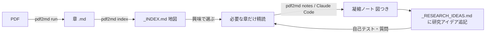

# 研究のための学習システム(少トークンで、興味に沿って深掘り、図つき、アイデア記録)

md にした教科書・論文を「研究に使える知識」に変えるための運用。狙いは4つ:
**①トークン最小 ②興味に沿って深掘り ③研究アイデアを記録 ④図つきで分かりやすく。**

## 全体の流れ



- **地図(_INDEX.md)** を入口にして、**興味のある章だけ**開く=トークン最小。
- **凝縮ノート**は Mermaid 図＋研究への示唆つき（`pdf2md notes`、または Claude Code）。
- 気づいた**研究アイデアは1か所に集約**（`_RESEARCH_IDEAS.md`）。

## 使うコマンド(ターミナル)

```bash
# 地図(0トークン)
pdf2md index --dir "<本のフォルダ>" --title "本の名前"

# 図＋研究アイデア入り凝縮ノート(APIキー要・一度きり)
pdf2md notes --dir "<本のフォルダ>" --model claude-opus-4-8   # 安く: claude-haiku-4-5
```
`pdf install -e .` 済みなら、フルパス `~/bakanposs/pdf2md/.venv/bin/pdf2md ...` でどこからでも。

## APIキーが無い / 使いたくない場合 → Claude Code で(サブスクを使う)

`notes` は Anthropic APIキーが要ります。無いなら **Claude Code** で同じことを:
その本のフォルダで Claude Code を開き、章ごとに下を貼る（**1章ずつ=少トークン**）。

**凝縮ノート(図＋研究アイデア)を作って保存**
```
08_....md を読んで、日本語で研究向け凝縮ノートを作り、同じフォルダの _notes/ に
08_..._notes.md として保存して。構成:
## 全体像(図) …Mermaidのflowchartで主要概念の関係
## 重要概念(定義つき)
## 概念どうしの関係
## 研究への示唆・アイデア …研究のどこに使えるか/問い/次に読む方向
## つまずきやすい点
## 理解確認クイズ(5問)+答え
引用は最小限、トークンを使いすぎないで。
```

**研究アイデアだけ蓄積(1ファイルに追記)**
```
いまの章から「研究に使えそうなアイデア・問い」を3つ、本のフォルダの
_RESEARCH_IDEAS.md に日付つきで追記して(既存は消さず追記)。各アイデアは
「観察 → なぜ重要 → 次の一歩」の3行で。
```

**複数の本・論文を横断してつなぐ(研究の芽)**
```
_RESEARCH_IDEAS.md と各本の _INDEX.md を見て、分野をまたぐ共通テーマや、
組み合わせると新しい問いになりそうな箇所を3つ挙げて。図(Mermaid)で関係を示して。
```

## トークンを節約するコツ
- **全章を一度に読ませない。** `_INDEX.md` で当たりをつけ、関係する章だけ開く。
- **1章1やり取り**。深掘りは同じ章に対して重ねる。
- 図は Mermaid（Obsidian がそのまま描画）。画像生成は使わない＝安い。
- 「読む」より**自分で説明→添削**（能動的想起）。理解が定着し、質問回数＝トークンも減る。

## 置き場所(Obsidian)
- 本ごと: `<Vault>/<本名>/` に章 .md、`_INDEX.md`(地図)、`_notes/`(凝縮ノート)。
- 研究アイデア: `<Vault>/<本名>/_RESEARCH_IDEAS.md`、横断用に `<Vault>/_RESEARCH_IDEAS.md` を1つ。
